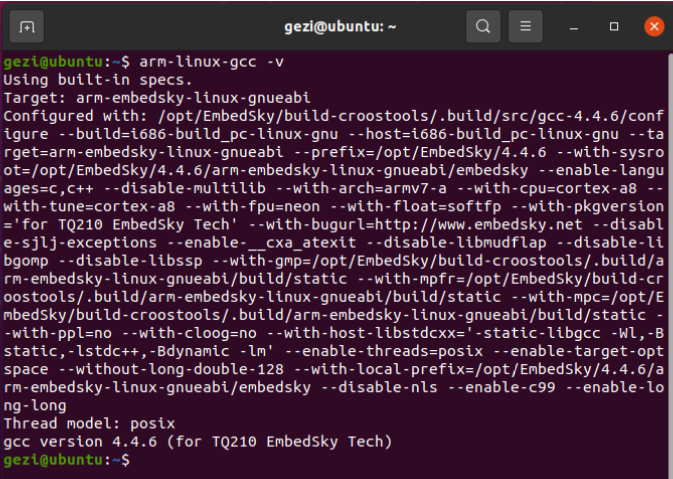
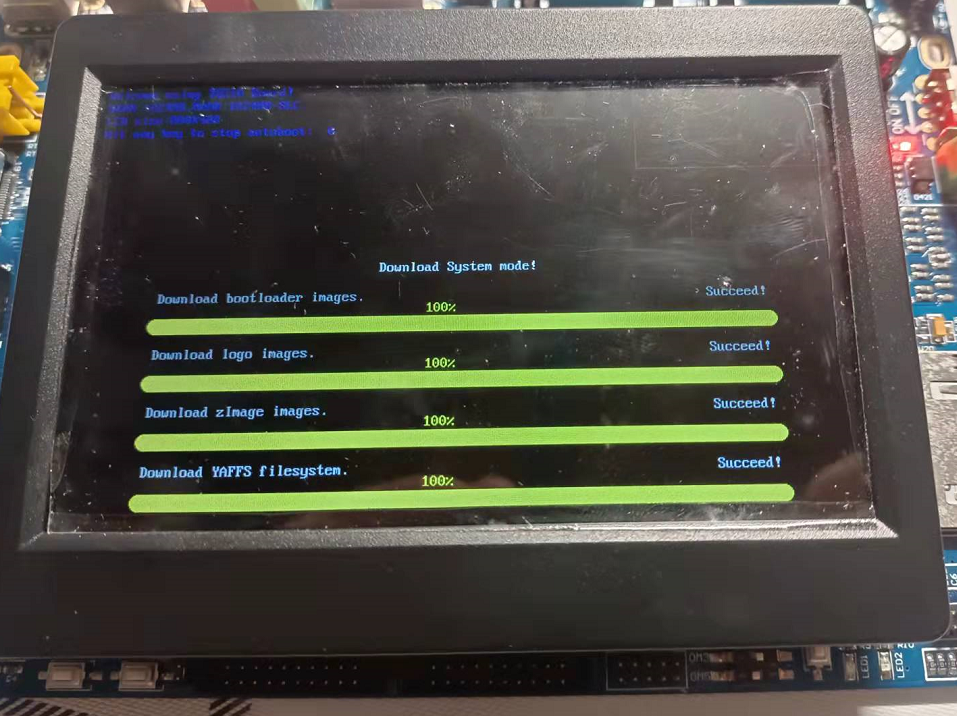
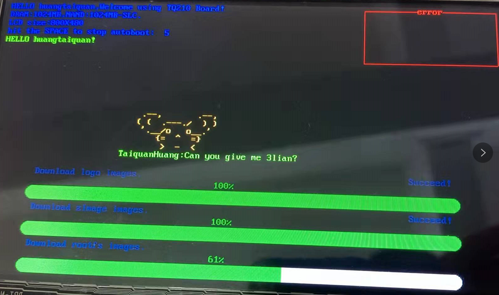
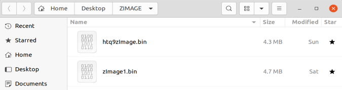
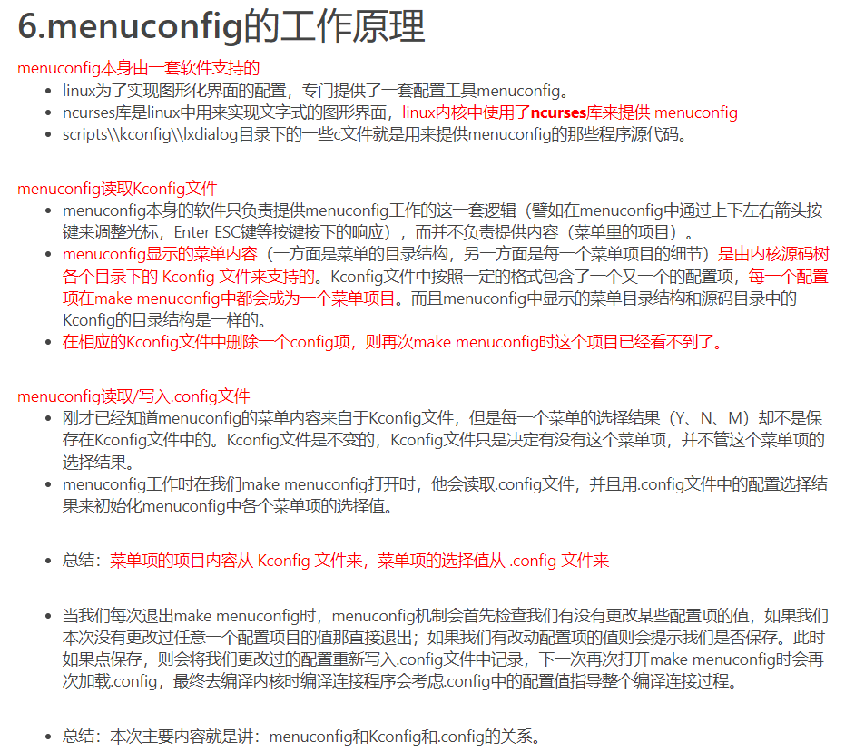
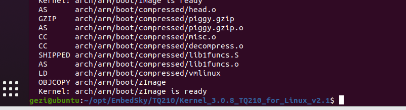
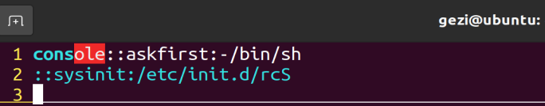
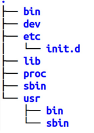
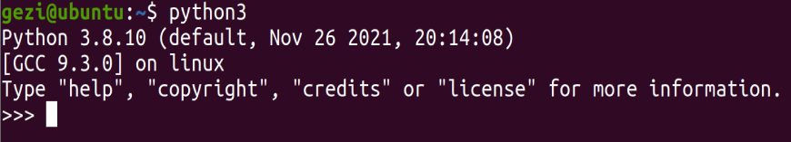
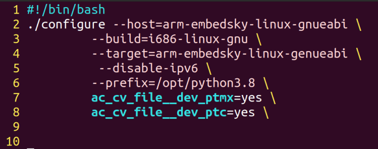

# Linux移植笔记

> 实验前，需要提前购置一条**USB转RS232串口线（公头）**，并先行测试开发板是否故障。

***

> 常见的Linux安装与使用方法有三种：完全独立安装，整个计算机操作系统；在Windows环境下，通过虚拟机安装Linux；WSL （Windows Subsystem for Linux ）。Linux大多采用虚拟机环境安装Linux。~~安装过程请自行百度~~

我的虚拟机环境是`VMware Workstation 16 PRO`, 系统是`Ubuntu 20.04.3 LTS`，开始环境必须是十分干净的，并且由于每个人的配置步骤都有差异，因此切忌在使用他人的步骤方法的同时交叉使用本篇笔记的步骤方法。

## 环境搭建

> **首先，在环境搭建开始前，请务必熟悉Linux常用指令。其次，配置环境是个复杂的过程，要多花点时间查阅相关资料，以便理解这些操作的原理。**

关于超级用户：

```powershell
sudo passwd root        #开启超级用户root并设置超级用户密码
su                      #超级用户模式（不推荐随意开启超级用户，否则会出现很多权限问题）
exit                    #退出超级用户
```

**arm-linux-gcc 4.4.6安装及环境配置**

1. 将官方资料中的`4.4.6_TQ210_release_20120720.tar.bz2`复制到 <u>家目录</u>（当然，放桌面也行，但是本文步骤全是按照家目录的来）
   
   [家目录]: 我用户名为gezi，那么家目录就是：/home/gezi
2. 创建新目录，进入`4.4.6_TQ210_release_20120720.tar.bz2`所在目录，解压到新目录并开放权限:
   ```powershell
   sudo mkdir /usr/local/arm           #创建新目录
   sudo chmod 777 /usr/local/arm       #开放所有权限
   cd /home/gezi                       #进入压缩包文件所在目录
   sudo tar -jxvf 4.4.6_TQ210_release_20120720.tar.bz2 -C /usr/local/arm       #解压到新目录，注意大写的C
   ```
3. 解压成功后，配置环境，可使用vim文本编辑器来编辑:
   ```powershell
   sudo apt install vim        #安装vim文本编辑器（个人喜爱vim更甚于vi，但其实不一定要用vi/vim）
   sudo vim /etc/profile       #编辑环境变量(此处默认读者已掌握vim的使用)
   ```
   
   在最下方添加两条语句:
   ```sh
   export PATH=$PATH:/usr/local/arm/opt/EmbedSky/4.4.6/bin
   export LD_LIBRARY_PATH=$LD_exLIBRARY_PATH:/usr/local/arm/opt/EmbedSky/4.4.6/lib
   ```
   
   保存并退出，并使之生效:
   ```powershell
   source /etc/profile
   ```
4. 安装32位库:
   ```powershell
   sudo apt-get update
   sudo apt-get install lib32z1
   sudo apt-get install libc6-dev-i386
   ```
5. 检查是否成功:
   ```powershell
   arm-linux-gcc -v       #检查arm-linux-gcc版本
   ```
   
   图例即为成功：
   
   

**Linux内核源码**

1. 将官方资料中的`Kernel_3.0.8_TQ210_for_Linux_v2.2.tar.bz2`拷贝至`/home/gezi`
2. 进入目录并将内核源码解压到当前目录:
   ```powershell
   cd /home/gezi
   sudo tar -jxv -f Kernel_3.0.8_TQ210_for_Linux_v2.2.tar.bz2
   ```
3. 进入解压后的目录:
   ```powershell
   cd /home/gezi/opt/EmbedSky/TQ210/Kernel_3.0.8_TQ210_for_Linux_v2.1
   ```
4. 编辑Makefile:
   ```powershell
   sudo vim Makefile
   ```
5. 找到`ARCH`字段，将原来的`ARCH        ?= $(SUBARCH)`更改为以下内容:
   ```makefile
   ARCH            ?= arm
   CROSS_COMPILE   ?= arm-linux-
   ```
6. 安装一些依赖包，以便后面的内核裁剪。
   ```powershell
   sudo apt-get install ncurses-dev    #ncurses库是linux中用来实现文字式的图形界面，linux内核中使用了ncurses库来提供menuconfig
   sudo apt-get install flex           
   sudo apt-get install bison          #flex和bison是两个用来生成程序的工具，它们生成的程序分别叫做词法分析器和语法分析器的
   sudo apt-get install libssl-dev     #libssl-dev是OpenSSL通用库
   ```

***

## U-Boot

> U-boot源码自己改一下启动时间和打印个欢迎界面吧。

1. 将官方资料中的`uboot_TQ210_1.3.4_V1.7.tar.bz2`复制到虚拟机的家目录中并解压，进入解压出来的目录:
   ```powershell
   sudo tar -jxvf uboot_TQ210_1.3.4_V1.7.tar.bz2
   cd opt/EmbedSky/TQ210/uboot_TQ210_1.3.4
   ```
2. 执行`make TQ210_config`(初始化配置)，结果需出现`Configuring for TQ210 board...`
3. 源码在`./common/main.c`下，可以更改其源码及相应的头文件实现以下的转变，非常简单：
   
   
   
   
4. 执行`make`(编译U-Boot)，等待片刻，最后出现以下内容时即完成U-Boot编译:
   ```powershell
   arm-linux-objcopy --gap-fill=oxff -0 srec u-boot u-boot.srec
   arm-linux-objcopy --gap-fill=oxff -0 binary u-boot u-boot.bin
   arm-linux-objdump -d u-boot > u-boot.dis
   ```
5. 将编译完成的`u-boot.bin`文件拷贝到`Windows`环境中，以便后续的`U-Boot`移植。

***

## 内核配置、编译

### 内核配置

1. 进入内核解压后的目录:
   ```powershell
   cd /home/gezi/opt/EmbedSky/TQ210/Kernel_3.0.8_TQ210_for_Linux_v2.1
   ```
2. 先按`TQ210 CoreB`板子的默认配置保存 `.config` 文件，这里选用`make menuconfig`的方法，进入裁剪界面后直接保存退出。**（不推荐一开始就裁剪,建议先跳到内核编译）**
   ```powershell
   cp config_for_TQ210_Linux_v2.1_CoreB .config
   make menuconfig
   ```
   > 如果觉得自己能力尚可，可自行体验裁剪过程，这里不打算列出裁剪的具体内容，大部分都是裁剪驱动，裁剪到4.3MB左右，但其实后面可以裁剪到3.8M左右。
   
   

> 简单易懂的`menuconfig`工作原理（[出处](https://www.136.la/tech/show-850211.html)）
> 
> 
根据上图的原理我们知道`.config`和`Kconfig`的作用，因此在裁剪前先把`.config`文件先拷贝一份，如果下次裁剪出现错误就把之前保存的`.config`文件覆盖回去，相当于返回去裁剪之前的状态。***注：`.config`文件是隐含文件，需要命令`ls -a`来查看***

### 内核编译

1. 为`include`目录下的`config`子目录和`generated`子目录开放权限:
   ```powershell
   sudo chmod -R 777 /home/gezi/opt/EmbedSky/TQ210/Kernel_3.0.8_TQ210_for_Linux_v2.1/include/config
   sudo chmod -R 777 /home/gezi/opt/EmbedSky/TQ210/Kernel_3.0.8_TQ210_for_Linux_v2.1/include/generated
   ```
2. 这里还有一个编译 `kernel perl` 版本 的*bug* 需要解决。先进入到`kernel`子目录下，找到并修改`timeconst.pl`文档，查看文档尾部，找到这段内容:
   ```perl
   @val = @{$canned_values{$hz}};
   if (!defined(@val)) {
        @val = compute_values($hz);    
   }
   ```
   
   将`if (!defined(@val))` 改为`if (!@val)`，这样，生成镜像文件应该就不会出错了。
3. 内核编译，生成镜像文件:
   ```powershell
   cd /home/gezi/opt/EmbedSky/TQ210/Kernel_3.0.8_TQ210_for_Linux_v2.1
   make zImage -j8        #-j8为8线程编译，没有该参数即是默认单线程（会很慢）
   ```
4. 编译成功（如下图），并将`zImage`映像二进制文件拷贝到`Windows`环境中，以便后续内核镜像的烧写。
   
   

> 这里整理了一些编译问题的例子，仅作为参考，其实大部分问题都是裁剪的错误。
> 
> > [参考链接](https://www.136.la/shida/show-251598.html)

***

## 文件系统制作

> - 补充一下嵌入式文件系统的知识。大家可以参考一下这篇[《嵌入式杂谈之文件系统》](https://zhuanlan.zhihu.com/p/127013819)，虽然涉及的概念比较多，但理解起来并不难。
> - Linux内核必须启动先挂载第一个文件系统`根文件系统`，成功之后可以自动或手动挂载单个或多个的`实际文件系统`（如`ext3`、`ext4`、`yaffs`、`yaffs2`、`jffs2`），再由这些文件系统提供统一、抽象、标准的接口提供给`虚拟文件系统(VFS)`进行文件系统的访问（打开、读、写等操作）。
> - `yaffs2文件系统`是`flash文件系统`，主要是为`Nand`型的`Flash`而设计的文件系统，专门为了应对`Flash`容量的快速增长。上面文章提到了`Nor Flash` 和 `Nand Flash`的特性，以及`yaffs2`相对的优缺点。

**mkyaffs2image（YAFFS2制作工具）**

> yaffs的制作工具版本不同最终可能会导致制作的根文件系统的失败......

1. 自行获取yaffs2压缩包，并解压：
   ```powershell
   tar -xvf yaffs2-source.tar
   ```
2. 进入`./yaffs2/utils`目录，`make -j8`编译生成mkyaffs2image等工具；
3. 将`mkyaffs2image`文件拷贝至/usr/bin：
   ```powershell
   cp mkyaffs2image /usr/bin
   ```

**Busybox**

> busybox就是Linux的工具箱，它集成了Linux的大部分命令和工具，编译后，在目标根目录中放置命令和工具，以便开发机调用这些Linux命令和工具。

1. 将官方资料自带的`busybox-1.20.0_for_TQ210_V1.0.tar.bz2`复制到虚拟机的家目录下；
2. 解压、进入解压后的目录中，并按照TQ210的busybox默认配置拷贝配置：
   ```powershell
   tar -jxvf busybox-1.20.0_for_TQ210_V1.0.tar.bz2
   cd ~/opt/EmbedSky/TQ210/busybox-1.20.0        #进入解压后的目录
   cp config_TQ210_V1.0 .config                #把官方为TQ210设置的配置值拷给.config文件（本文内核裁剪部分已提及过.config的作用）
   ```
3. 裁剪功能，默认不修改，直接退出保存（喜欢裁剪的也可以自行裁剪）
   ```powershell
   make menuconfig
   ```
4. 编译busybox
   ```powershell
   make -j8
   make install
   ```

**构造目标机的文件系统**

1. 上述编译出来时生成了`root_TQ210_fs`目录，在该目录创建`etc`目录，并在`etc`目录下创建`inittab`文件，并写入如图所示的内容：
   ```powershell
   cd ~/opt/EmbedSky/TQ210/root_TQ210_fs
   mkdir etc
   cd etc
   vim inittab
   ```
   
   
2. 在`etc`目录下创建`init.d`目录，创建`rcS`脚本，并写入`mount -t proc none /proc`
   ```powershell
   mkdir init.d
   cd init.d
   vim rcS       //写入内容为mount -t proc none /proc
   ```
3. 返回到`root_TQ210_fs`目录，创建`dev`目录，并创建字符设备文件：
   ```powershell
   cd ~/opt/EmbedSky/TQ210/root_TQ210_fs
   mkdir dev
   cd dev
   sudo mknod console c 5 1
   sudo mknod null c 1 3
   ```
4. 根据下图补全其他目录：
   
   
5. 制作rootfs镜像
   ```powershell
   cd ~/opt/EmbedSky/TQ210                   #下面制作的镜像会在这里产生
   mkyaffs2image root_TQ210_fs/ rootfs.bin   #rootfs是生成该二进制文件的名称，可以随便改
   ```

***

## SQLite移植

1. 前往[SQLite源码下载地址](https://www.sqlite.org/download.html?spm=a2c4e.10696291.0.0.3debl9a4DBFn52)，下载带有`sqlite-autocof-`的源码包，并拷贝到家目录
2. 执行以下指令:
   ```powershell
   tar -zxvf sqlite-autoconf-3370000.tar.gz  
   cd sqlite-autoconf-3370000 
   ./configure --host=arm-linux --prefix=/home/gezi/opt/EmbedSky/TQ210/sqlite-autoconf-3300100/install
   make -j8
   make install
   ```
3. 编译完成后将sqlite3复制到根文件系统下的bin目录中，将lib文件夹里的libsqlite3.so.0.8.6复制到根文件系统的lib目录中，最后使用mkyaffs2image重新制作文件系统镜像。

***

## Python移植



1. 在python官网选择`python3.8.10`下载
2. 载好并解压源码包，进入目录，生成`Makefile`文件并编译
   ```powershell
   tar -xvf Python-3.8.10.tgz
   cd Python-3.8.10
   ./configure –prefix=/opt/python3
   make -j8
   make install
   ```
3. 新建脚本，输入图中内容（不要输错，否则后面将编译安装失败）
   ```powershell
   vim build.sh        #新建脚本
   ```
   
   
4. 执行脚本，生成开发板使用的`Makefile`
   ```powershell
   bash build.sh
   ```
5. 编译、安装：`make -j8`、`make install`
6. 将`--prefix `后面指定文件路径中编译出来的四个目录的所有文件拷贝到开发板的/usr/bin目录下；
7. 给开发板根文件系统创建内核随机数源设备文件：

```powershell
sudo mknod -m 644 ~/opt/EmbedSky/TQ210/root_TQ210_fs/dev/urandom c 1 9
```

8. 使用mkyaffs2image重新制作文件系统镜像，这样python就能挂载在根文件系统里了。

***

## 烧录

> 做完上述的所有步骤，还可以为开发板增添更多交互式应用，以及利用python做一个命令交互、对sqlite操作并带有界面等。

烧录的过程就不细说了，非常简单，按照提示一步一步来就行。注意每次打开DWN时都要以管理员方式运行。

***
